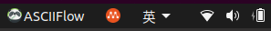

# af

> Local packaging for https://asciiflow.com/

## Feature

+ Support ASCIIFlow2 & <del>ASCIIFlow3</del>
+ Supported on Windows, macOS, and Linux
+ Desktop tray-icon



## Dev & Build

```shell
$ git clone git@github.com:g-lib/af.git
$ cd af
$ sudo apt-get install libgtk-3-dev libappindicator3-dev -y
$ go build .
```
